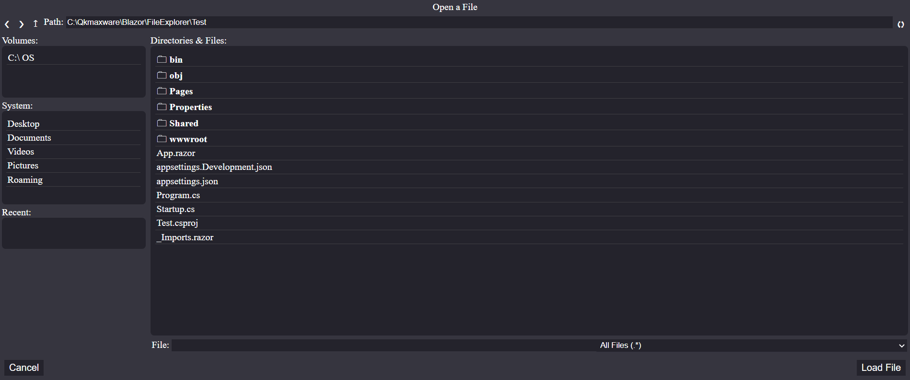

# FileExplorer
Qkmaxware.Blazor.FileExplorer is a file browser/explorer component for Blazor. This component allows one to view/navigate the host/server computer's filesytem. **THIS COMPONENT IS NOT DESIGNED FOR USE IN WEB PROJECTS** due to the security risk that it exposes by allowing users to see the server's filesystem. It is designed mainly for usage with desktop blazor applications where users want to be able to save/load their app's data. Such dekstop applications can be made using tools like ElectronNet or Blazor Desktop. 

- [FileExplorer](#fileexplorer)
  - [License](#license)
  - [Example](#example)
  - [Tutorial](#tutorial)
    - [Creating a File Explorer](#creating-a-file-explorer)
    - [Filter Filetypes](#filter-filetypes)
    - [Custom Confirmation Button Text](#custom-confirmation-button-text)
    - [Triggered Events](#triggered-events)

## License
See [License](LICENSE.md) for license details.

## Example
An example of how to use and customize the node-editor can be shown in the [Test](Test) directory of this repo. 



## Tutorial
### Creating a File Explorer
It is easy to add this component to any other Blazor component (a webpage or a modal for instance). Simply add the correct **using** paths and create an instance of the FileExplorer.
```cs
@using Qkmaxware.Blazor.FileExplorer.Components

<FileExplorer Title="Open a File"></FileExplorer>
```
If you want users to be able to type their own file-names into the explorer as would be the case with a file save dialog, make sure to add the AllowEdit=true option to the FileExplorer as can be seen below.
```cs
@using Qkmaxware.Blazor.FileExplorer.Components

<FileExplorer Title="Open a File" AllowEdit=true></FileExplorer>
```

### Filter Filetypes
Often it is important to only show a subset of files in the explorer. It wouldn't make sense for an image browser to show text files after all. To do this, simply provide the component with a list of FilenameFilter objects which use regular expressions to determine which files are visible. You may provide multiple filters, but only one can be active at any given time, the rest will show up in a dropdown on the component.
```cs
@using Qkmaxware.Blazor.FileExplorer.Components
@using Qkmaxware.Blazor.FileExplorer.Data

<FileExplorer Title="Open a File" AllowEdit=true Filters=filters ></FileExplorer>

@code {
    private FilenameFilter[] filters = new FilenameFilter[]{
        FilenameFilter.Any(),
        FilenameFilter.Extension("Any Image", "png", "jpeg", "jpg", "tif"),
        FilenameFilter.Extension("Any Video", "mp4", "mpeg", "avi"),
        FilenameFilter.Extension("Any Audio", "mp3", "wav", "flak"),
        FilenameFilter.Extension("Code", "csproj", "cs", "json", "razor", "cshtml"),
    };
}
```

### Custom Confirmation Button Text
File explorers need to display different text on their **Confirmation** button. By default the text is a generic "Ok" but this is meant to be changed. Simply set the component's ConfirmationText parameter to whatever you need it to say.
```cs
@using Qkmaxware.Blazor.FileExplorer.Components

<FileExplorer Title="Open a File" ConfirmationText="Open File"></FileExplorer>
```

### Triggered Events
The component has two events that can be triggered via actions within the component.

| Event | Description | Parameters |
|-------|-------------|------------|
| OnCancel | Fired when the user presses the Cancel button | |
| OnConfirm | Fired when the user pressed the Confirmation button | Full path to the selected file |

These events can be bound using the OnCancel and OnConfirm parameters that accept **Action** delegate method pointers. 
```cs
@using Qkmaxware.Blazor.FileExplorer.Components

<FileExplorer Title="Open a File" OnConfirm=load OnCancel=hide></FileExplorer>

@code {
    public void load(string path) {
        ...
    }
    public void hide() {
        ...
    }
}
```